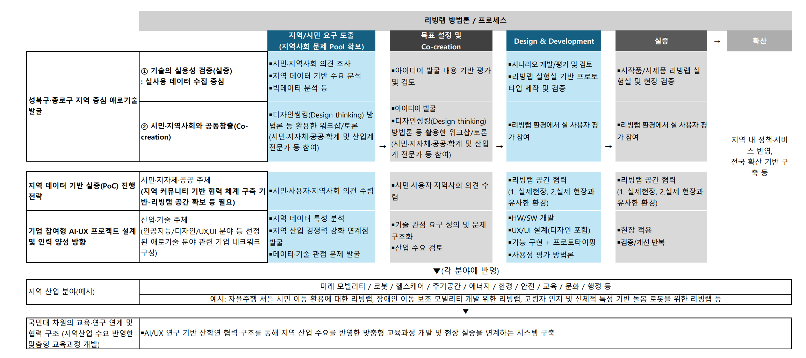

# Untitled

# 서울디지털산업단지(G밸리) **산학협력 모델** 제안   2025년 12월 8일
- IT 기업들이 직면한 인력난·비용 부담·기술 전환 등의 현실적 어려움을 해결할 수 있는 **실질적·즉효성 중심의 산학협력 모델** 제안
- 본 전략은 단순 교육을 넘어 기업의 **생산성 향상, 비용 절감, 수익 확대, 신규 사업 창출**까지 연결되는 상생형 산학 AI 모델을 목표로 함

---

# 1. **G밸리 기업의 현안 해결형 AI 교육 및 인턴십 연계**

- 기업들이 원하는 것은 이론 중심 교육생이 아닌 **즉시 투입 가능한 실무형 AI 인재임**
- 국민대는 다음 3단계 모델을 통해 기업의 실제 업무와 연결된 맞춤형 AI 교육 프로그램을 제공함

### **[1] 초단기 실무교육 – 1주 완성 AI 코파일럿 과정**

- Copilot, GitHub Copilot, ChatGPT 등 최신 생성형 AI 활용 실습
- 반복 업무 자동화·개발 생산성 향상
- 기업이 빠르게 교육 효과를 체감할 수 있는 즉효형 모델

### **[2] 현장 맞춤형 프로젝트·인턴십 매칭**

- 국민대 학생 + G밸리 기업 실문제 기반 프로젝트 수행
- 2~4주 단기 인턴십으로 검증된 인재를 선별하여 채용 리스크 감소
- 기업 자체 도입이 어려운 AI 활용을 학생 프로젝트로 해결

### **[3] 데이터 분석 역량 강화 워크숍**

- 마케팅/영업/고객 데이터 기반 분석 실습
- 기업 의사결정 고도화, 고객 예측 모델 적용
- 기업 데이터로 수행 가능(보안 준수 프로토콜 포함)

---

# 2. **미래 성장동력 확보를 위한 특화 AI 컨설팅 및 사업 연계**

- 국민대 교수·학생 연구진이 보유한 AI 역량을 기반으로 기업의 **디지털 전환(Transformation)**, **AI 도입 전략 수립**, **신규 비즈니스 발굴**을 지원함

## [1] 인공지능 컨설팅·SI 협력 강화

- ‘AI 사업화 타당성 검토 지원단’ 운영
- 기존 S/W 시스템의 AI 전환 방향성 제시
- 기업 실무진과 공동으로 PoC(개념 검증) 추진
- AI 분야 전문 인력 양성 과정 연계 가능

## [2] 산업별 특화 AI-X 융합 프로그램

- **반도체·임베디드 분야**: Edge AI, NPU 활용 모델 개발 협력
- **스마트팩토리**: 영상 분석·설비 예지보전 AI
- **금융/핀테크**: 이상 거래 탐지(FDS), 신용평가 AI 고도화

---

# 3. **G밸리 IT 기업의 대표·직원이 체감하는 획기적 AI 솔루션 제안**

- 국민대는 기업의 즉각적 성과를 목표로 다음 두 가지 축을 중심으로 솔루션을 제공

---

## 3.1 기업의 비용 절감과 수익 극대화를 위한 AI 퀵윈(Quick-Win) 모델

### **A. AI 비용 최적화 진단 서비스 (AI Cost-Cutting Audit)**

- 클라우드 사용료, 개발 환경 운영비, 반복 업무 AI 자동화 가능 여부 진단
- 단기간(2~4주) 내 비용 절감 요소 도출
- 비용 대비 효과가 즉시 나타나는 모델을 제시

### **B. AI 기반 신규 비즈니스 모델 발굴 (G-Valley AI Pivot Challenge)**

- G밸리 기업 14,300여 개를 대상으로 AI 기반 서비스 아이디어 공모전 운영
- 기업은 비용 부담 없이 우수 아이디어를 확보
- 국민대가 개발 및 인턴십 연계 지원

---

## 3.2 직원 역량 업그레이드를 위한 참여 유인 기반 프로그램

### **A. AI 자격증/인증 100% 합격 책임제(AI Career Boost)**

- 국민대 AI 교수진의 직접 개발 커리큘럼
- 산업 현장에서 인정되는 실무형 AI 자격 취득 지원
- 기업은 직원 이직률 감소 및 복지 제공 효과
- 직원은 ‘성장 목표’ 기반 자기주도 학습 유도

### **B. 기업 리더 대상 실전 AI MBA 과정 (AI Leadership Immersion)**

- 중간관리자·임원을 위한 AI 시대 경영 전략 교육
- 데이터 기반 의사결정·AI 도입 로드맵 설계 중심
- 기업의 조직문화 혁신과 AI 경영 체질화 지원

---

# 4. **국민대학교 제안**

### 비용 효율성

정부·지자체 사업 및 국민대 자원을 활용해 기업의 교육·도입 부담 최소화.

### 즉효적 성과 제공

장기 교육보다 1~4주 단위의 **단기 챌린지형 프로그램**으로 빠른 효과 체감.

### 실무 중심 프로젝트

기업 데이터, 실제 문제 기반 프로그램 운영 → 바로 활용 가능한 인재 확보.

### Win-Win 구조

기업의 생산성·비용 절감 + 대학의 교육 목표(미래 AI 인재 양성) 동시 달성.

---

#


# **리빙랩 프로세스 기반 지역산업 AI전환 및 AI·X+AI 창업 활성화**  2025년 12월 05일

---

### **1. 리빙랩 기반 지역 주력산업 AI전환 및 AI·X+AI 창업 활성화 지원**

- 지역 산업 문제 도출 → 리빙랩을 통한 문제 해결 및 기술검증 → AI 기반 인재양성·교육과정 운영 → 산업 문제 해결 프로젝트 → AI·X+AI 창업으로 확산
- 이 구조는 *현장의 실증(PoC)* → *AI 인재양성* → *창업 및 확산* 으로 이어지는 **지역 혁신 생태계 구축 모델**임



---

### 2. **리빙랩 프로세스와 AI전환·창업 지원의 연결 구조**

### 단계 1) 지역/시민 요구 도출 ↔ 지역 산업 AI 수요 분석

- 리빙랩 도표의 첫 단계인 **시민·지역사회 의견조사, 데이터 분석, 문제 Pool 확보**는 AI 전환 사업의 **지역 산업 수요 반영**, **기업 애로 발굴**, **맞춤형 교육·프로젝트 기획**과 직접 연결됨.
- 이 단계와 연결되는 AI전환·창업 지원 요소
    - 지역 산업 기반 AI 전환 생태계 구축
    - 지역 산업 수요 반영 맞춤형 교육과정 개발
    - 지역 특화산업 애로기술 발굴
    - 데이터 기반·센서 기반 교육 운영
- 즉, 리빙랩의 문제 발굴이 **AI전환 교육·프로젝트의 기초 데이터**가 됨.

---

### 단계 2) Co-creation(공동창출) ↔ 기업 참여형·현장 기반 교육/프로젝트 설계

- 리빙랩의 공동창출 단계(아이디어 발굴, 디자인씽킹 워크숍 등)는 AI전환 사업의 **기업 참여형 교육과정**, **애로기술 해결 프로젝트**, **PBL 기반 프로젝트**와 연계됨.
- 이 단계와 연결되는 AI전환·창업 지원 요소
    - 기업 참여형 교육과정 개발
    - 기업 맞춤형 AI 융합 엔지니어 양성
    - 기업 참여 PBL 프로젝트 추진
    - 지역 특화산업 문제 해결 프로젝트 설계
    - 지역 산업 애로기술 해결 프로젝트 추진
- 즉, 공동창출 단계는 **교육과 프로젝트의 커리큘럼·내용 구성 단계**로 연결됨.

---

### 단계 3) Design & Development ↔ PoC 실증 및 현장 기술개발

- 리빙랩에서 시나리오 개발, 프로토타이핑, UX/UI 설계가 진행되는 단계.
- 이것은 AI/AI+X 모델링, 현장 실증 프로젝트, 기술 실험과 직결됨.
- 이 단계와 연결되는 AI전환·창업 지원 요소
    - 지역 데이터 기반 PoC 전략
    - HW/SW 개발
    - UX/UI 설계
    - 기능 구현 및 프로토타이핑
    - AI전공·X+AI 교육 과정 속 실습
    - 특정 기업 맞춤형 문제 해결
- 즉, 이 단계에서 **실제 산업 현장의 문제 해결 기술이 개발됨**.

---

### 단계 4) 실증(PoC) ↔ 지역 산업 문제 해결·AI 전환 실현

- 리빙랩 실증 단계는 현장에서 기술을 검증하는 단계이며,
- AI전환 사업의 “산업 AI 전환”이 실질적으로 일어나는 핵심 구간.
- 이 단계와 연결되는 AI전환·창업 지원 요소
    - 실사용 환경 리빙랩 실증
    - 기업 수요 기반 실증 테스트
    - 로봇·모빌리티 등 특화 산업 애로기술 실증
    - 현장 피드백 반영(검증·개선 반복)
- 즉, 실증 단계는 **지역 산업 현장에서 AI 적용의 실질 성과를 만드는 단계**.

---

### 단계 5) 확산 ↔ 창업·사업화·지역 확산

- 리빙랩의 마지막 단계인 확산(정책·서비스 반영, 전국 확산 기반 구축)은
- AI전환·창업 지원의 마지막 축인 **AI 기반 창업, Seed Money, 창업 지원제도**와 직접 연결됨.
- 이 단계와 연결되는 AI전환·창업 지원 요소
    - AI 전공 및 X+AI 융합 교육 결과 창업 아이템 발굴
    - 예비 창업자 교육 인증제
    - 창업 지원비 제공
    - 창업 휴학제·학기제 도입
    - Seed Money 확보 및 추가 재원 확보
    - 지역 기업과의 공동 프로젝트 사업화 가능성 확대
- 즉, 리빙랩에서 도출된 문제 해결 기술이 **창업 및 지역산업 혁신으로 이어지는 구조**가 완성됨.

---

### 3. 흐름도

```
[지역/시민 문제 도출]
     ↓
[공동창출(Co-creation)] – 기업 참여·문제 정의·프로젝트 설계
     ↓
[Design & Development] – AI 기반 기술 개발·프로토타이핑·교육 실습
     ↓
[실증(PoC)] – 산업 현장 중심 AI 전환 및 문제 해결
     ↓
[확산] – 창업 활성화·사업화·정책 반영·산업 생태계 강화

```

---

### 4. 핵심

| 리빙랩 단계 | 연결되는 AI전환·창업 활성화 내용 |
| --- | --- |
| **문제 도출** | 산업 수요 조사, 데이터 분석, 맞춤형 교육·프로젝트 설계 |
| **공동창출** | 기업 참여형 교육과정, AI·UX 프로젝트 설계, 문제정의 |
| **디자인·개발** | AI 모델링, 기술 개발, UX/UI, PoC 준비, 기업 맞춤형 실습 |
| **실증** | 현장 테스트, 애로기술 해결, 성능 검증·개선 |
| **확산** | 창업아이템 발굴, 창업지원제도, Seed Money, 기술사업화 |

---

# **추진체계 및 추진전략**

---

### Ⅰ. 추진체계(운영 구조)

### 1) **총괄 운영체계**

- 본 사업은 **성북구–국민대학교–지역기업·기관–시민**이 참여하는 개방형 리빙랩 구조로 운영되며, 정책–산업–교육–실증–창업 생태계를 연계하는 **4중(四重) 협력 구조**로 구성된다.

### (1) 성북구(지자체)

- 지역 산업·기관 현황 제공 및 정책 연계
- 관내 기업·기관 참여 지원
- 실증 현장 지원 및 행정 협조
- 지역 확산 전략 및 KPI 관리 참여

### (2) 국민대학교(주관기관)

- AI·데이터·UX 기반 연구·교육 수행
- 기술검증(PoC), 실증 과정 총괄
- 기업 참여형 PBL 교육 운영
- 지역기업·기관 문제 발굴 및 해결 설계
- 창업지원 및 Seed Money 확보 연계

### (3) 지역기업·기관(산업체 파트너)

- 현장 애로기술 및 문제 제공
- 실증(PoC) 적용 및 피드백 제공
- 공동 연구·개발 및 현장 평가 참여

### (4) 시민·이용자 그룹

- 문제 제기 및 서비스 개선 요구 도출
- 리빙랩 검증 과정에서 사용자 평가 제공

---

## 2) **추진 조직 구성**

| 조직 | 역할 |
| --- | --- |
| **사업총괄위원회** | 지자체–대학–산업체 공동 거버넌스 운영, 주요 의사결정 |
| **리빙랩 운영단** | 문제 발굴·데이터 분석·서비스 기획·PoC 운영 |
| **AI·UX 기술개발팀** | AI 모델링, 시스템 개발, UX/UI 설계 |
| **산업협력팀** | 기업 수요 조사, 현장 연계, 기술 매칭 |
| **창업지원팀** | 창업·사업화 지원, Seed Money 연계 |
| **성과관리(KPI)팀** | 지표관리, 확산전략 수립, 평가 |

---

### Ⅱ. 추진전략

추진전략은 **①문제발굴 – ②공동창출 – ③개발·실증 – ④확산 – ⑤창업·인재양성**의 구조로 설정하며,

리빙랩 방법론을 기반으로 AI전환·창업 활성화를 통합적으로 추진한다.

---

### 전략 1. **지역문제 기반의 AI 전환 생태계 구축(Problem-driven Transformation)**

### 세부 전략

1. 지역 산업·기업 대상 데이터 기반 AI 수요 분석
2. 의료·교육·문화·소상공인 중심 애로기술 발굴
3. 빅데이터 분석을 활용한 문제 Pool 확보
4. 시민·사용자 인터뷰 및 현장조사를 통한 요구 확인

### 기대효과

- 지역에 특화된 문제 중심 AI 전환 모델 구축
- 초기 단계부터 산업계·사용자의 요구 반영률 증가

---

### 전략 2. **리빙랩 기반 공동창출(Co-creation) 및 기술개발 강화**

### 세부 전략

1. 디자인씽킹 기반 문제 정의 및 해결방안 도출
2. 기업·지자체·전문가 공동 워크숍 운영
3. 기업 참여형 PBL 프로젝트 구조화
4. HW/SW·AI 모델링·UX/UI 동시 개발 체계 구축

### 기대효과

- 현장 적용성이 높은 실용기술 개발
- 기업 참여도를 높여 기술–교육–현장 간 정합성 확보

---

### 전략 3. **AI 기반 PoC(개념 검증) 및 현장 실증 체계 구축**

### 세부 전략

1. 실제 환경에서의 리빙랩 실증 (병원·학교·공공시설·소상공인 매장 등)
2. AI 기반 매출예측, 의료 문서 요약, 데이터 분석 등 실증 운영
3. 사용자 평가(UX, 행동데이터 기반) 및 지속 개선 피드백
4. 성북구와 협력한 실증 공간 확보 및 확대

### 기대효과

- 지역 문제 해결 성과 가시화
- 기술 개선 및 창업 아이템 고도화에 직접 기여

---

### 전략 4. **AI·X+AI 기반 창업 활성화 전략 구축**

### 세부 전략

1. 지역 문제 기반 창업 아이템 발굴 시스템 운영
2. MVP(시제품) 개발 및 현장 실증 지원
3. Seed Money 확보 및 정부·민간 투자 연계
4. 예비창업자 교육 인증제·창업휴학제·창업학기제 도입
5. 기술·비즈니스 모델 개발을 위한 전문가 멘토링

### 기대효과

- 지역 문제 기반 창업 생태계 조성
- 조기 스타트업 성장 및 지역 일자리 창출

---

### 전략 5. **산학협력 기반 AI 인재 양성 체계 확립**

### 세부 전략

1. 지역 산업 수요 기반 맞춤형 교육과정 개발
2. 기업 맞춤형 AI 엔지니어 양성(기업 연계형 학과 포함)
3. 데이터 기반·센서 기반 실무 교육 운영
4. 산업현장 문제 기반 PBL 교육 운영
5. 기업 연계 인턴십 및 취업 연계 지원 강화

### 기대효과

- 지역 기업이 필요로 하는 즉시투입형 AI 인재 확보
- 교육–현장–창업 간 선순환 구조 완성

---

### 전략 6. **정책·서비스 확산 및 지속가능한 성과관리 체계 구축**

### 세부 전략

1. 성북구 정책과 연계한 AI 서비스 적용 확대
2. PoC 성과 기반 전국 단위 확산 모델 구축
3. AI전환 성과(KPI) 공동관리:
    - 애로기술 해결 건수
    - 창업 아이템·스타트업 창출 수
    - 참여기업 만족도
    - 실증 완료 기술 수
4. 지속 가능한 산학협력 네트워크 운영

### 기대효과

- 지역혁신 성과의 제도화·정책 반영 가능
- 장기적·지속적 지역 혁신 플랫폼 구축

---

### Ⅲ. 종합 추진 로드맵

```
1년차: 지역 문제 발굴 → 공동창출 워크숍 → PoC 설계 → AI 교육과정 개설
2년차: PoC 실증 → 기업 참여형 PBL 운영 → 창업 아이템 발굴
3년차: 성과 기반 확산 → 창업 지원 강화 → 투자 유치 → AI 인재 양성 고도화

```

---

### Ⅳ. 기대 성과

- 지역 주력 산업의 체계적 AI 전환
- 20개 이상 지역기업 애로기술 해결
- AI 기반 창업팀 10팀 이상 창출
- 지역문제 기반 실증기술 10건 이상 확보
- 성북구–국민대 공동 KPI 기반 성과관리 모델 확립

- 


# 6. 지역 주력산업 AI전환 및 AI, X+AI 융합 창업활성화 지원

- “지역산업 수요를 반영한 맞춤형 교육과정 + AI/로봇 + 리빙랩 + 실증 + 사업화”  2025년 11월 28일
    - 현실적 가능성이 높고, 최근 국내외에서도 비슷한 시도와 연구가 활발
    - **가능성, 근거**와 **주의할 점 / 설계 시 고려해야 할 요소**,  **구체 설계 틀** 제안

---

## 구상 근거 & 트렌드

- Living Lab 방식을 활용하면,
    - 노약자·장애인 등 실제 사용자 환경 속에서 로봇/서비스를 검증하고 개선할 수 있음.
    - 실제 “고령자 대상 동반 로봇 / 복지 로봇” 개발에서 living-lab 기반 서비스 설계의 중요성이 제시되고 있음. ([MDPI](https://www.mdpi.com/2313-7673/8/8/609?utm_source=chatgpt.com))
- 예컨대, 최근 연구에서는 고령자나 장애인을 위한 돌봄 로봇이 “일상 기능 보조, 이동 지원, 주거지 환경 적응, 정서/사회적 지원”까지 포함할 수 있다는 보고가 있고,
    - 이런 로봇은 단순 연구‒실험실 단계를 넘어 “실생활 적용 / 서비스화” 가능성이 높다는 분석이 나옴. ([ResearchGate](https://www.researchgate.net/publication/380373435_Humanoid_robots_for_assisting_people_with_physical_disabilities_in_activities_of_daily_living_a_scoping_review?utm_source=chatgpt.com))
- 또한 스마트홈, 복지기술, ICT 기반 도시 포용성 향상을 위해 리빙랩 방식이 권고되고 있으며,
    - 이는 단순 기술 개발을 넘어 사회문제 (고령화, 장애, 복지, 주거, 돌봄 공백) 해결 측면에서 가치가 큼. ([SI](https://www.si.re.kr/sites/default/files/SR%2020-03.pdf?utm_source=chatgpt.com))
- 이런 흐름 덕분에, “대학 + 학과/랩 + 지역(지자체) + 실생활 수요 + 산업 / 기업 연결 + 창업/사업화” 모델은 국내외에서 트렌드이자 필요성 있는 방향이라는 근거가 충분
- 즉, 단순한 연구과제나 학습 프로그램이 아니라, 사회문제 해결 + 실용 기술 개발 + 지역복지/산업 + 창업/사업화까지 연결하는 ‘융합형’ 모델로서 의미와 실현 가능성이 높습니다.

---

## 설계 시 주의할 점 및 도전 과제

- 이런 복합 구조를 설계·운영하려면 아래 점들을 면밀히 고려
    - **사용자 수요 조사 및 참여자 확보**
        - 노약자/장애인 대상이라면, 실제 수요 조사, 사용자 환경 분석, 사회복지기관 및 지자체 협력, 사용자 동의 및 신뢰 확보가 필수.
    - **윤리ㆍ안전 / 개인정보 & 프라이버시 / 법적/규제 문제**
        - 돌봄 로봇이나 복지용 기기는 안전성, 개인정보 보호, 사용자 권리, 책임소재 등 고려사항이 많음.
    - **리빙랩 + 실증 + 설계 반복의 긴 시간과 자원**
        - 실생활 테스트, 사용자 피드백, 개선, 재테스트 — 이 과정을 반복해야 하므로 시간과 자원이 많이 듦.
    - **교육과 실무 및 사업화 간 밸런스 유지**
        - 학생 교육 목적, 연구 목적, 사회 문제 해결 목적, 그리고 사업화 목적이 복합되면 때론 목표가 충돌할 수 있음. 각 이해-관계자의 기대를 조율할 필요.
    - **지속 가능한 운영 구조 마련**
        - 일회성 프로젝트가 아니라, 유지 보수, 업데이트, 사용자 지원, 비즈니스 모델, 수익 모델, 파트너 책임 등 장기 운영 구조를 설계해야 함.
    - **협력 주체 간 거버넌스와 역할 정의**
        - 대학, 학과/랩, 지자체, 사회복지기관, 기업, 사용자 등 여러 주체가 얽히므로, 역할·책임·의사결정 구조를 명확히 정의해야 함.

---

## 제안 설계 틀 (컨셉 + 단계 구조)

구상한 흐름을 바탕으로 한 **‘맞춤형 교육 + 실증 + 창업’ 통합 설계 틀** 

**1. 초기 조사 및 요구 분석 단계**

- 지역(예: 성북구, 종로구) 및 커뮤니티
    - 노약자, 장애인, 고령자, 독거노인, 복지기관, 사회복지센터 등 대상과 인터뷰/설문 조사 → 주된 생활 불편, 돌봄 필요, 주거환경, 이동/안전/건강/정서 문제 등 수요 분석
- 지역 기업, 사회적 기업, 복지기관, 지자체 담당자들과 미팅
    - → 수요, 정책 방향, 지원 가능성, 사회복지 프로그램 요구 파악

**2. 학제 간 커리큘럼 + 팀 구성**

- SW 학부
    - 로봇 제어, AI, 소프트웨어 개발
- 인공지능 학부(또는 관련 공학/로봇 전공)
    - 로봇 하드웨어, 센서, 제어, 임베디드 시스템
- 스마트경험디자인학과 + 디자인/인간공학
    - 사용자 경험(UX), 인간–로봇 상호작용(HRI), 주거환경 분석, 리빙랩 설계
- 사회복지 / 복지학과 (또는 복지 기관 연계)
    - 사용자 요구, 윤리/복지 관점, 사용자 지원/관리, 커뮤니티 연계
    - 이들을 팀으로 묶어, 프로젝트 기반 수업(PBL) + 실습 + 리빙랩 실증 + 창업 아이템 개발 진행

**3. 리빙랩 기반 실증 및 검증**

- 대상 지역 / 주거 환경 또는 복지기관/노인시설/가정집 등 실제 생활 환경을 리빙랩 공간으로 설정
- 사용자 참여
    - 노약자, 장애인, 복지 대상자, 사회복지사, 돌봄 제공자 등과 함께 공동 설계(co-creation), 테스트, 피드백 반복
- AI/로봇 프로토타입 개발 → 실증 → 사용자 피드백 → 개선 → 재실증 (iterative cycle)

**4. 창업 및 사업화 연결**

- 개발된 로봇/서비스 모델을 기반으로, 대학 산학협력 조직 또는 지주회사 (예: KMU Holdings ) + 지역 기업(예: 가산디지털단지의 중소기업)과 협력 구조 설계
- 초기 창업 또는 사업화 계획 수립: 제품/서비스, 시장(지역 복지기관, 지자체, 노인/장애인 가정 등), 비즈니스 모델, 운영·유지보수, 사용자 지원 및 서비스 체계 설계
- 투자/펀드 또는 지자체 복지 예산 등 자금 조달 경로 탐색

**5. 교육 과정과 인증 / 융합 프로그램화**

- 위 프로젝트 과정을 정규/비정규 교육 과정 또는 선택 과목으로 편성 — 학과 간 융합 + 실무 중심 커리큘럼
- 리빙랩 / 사회복지 / 복지 로봇 / 스마트홈 / AI 융합 서비스 개발 / 창업 실습 / 사업화 과정 포함
- 졸업 후 창업, 스타트업, 사회적기업, 복지기관 협력 등 진로 경로 마련

**6. 평가 및 지속 운영 구조 마련**

- KPI / 성과지표
    - 사용자 만족도, 복지 효과, 서비스 이용률, 사업화 성공률, 고용/창업 수, 유지보수/운영 안정성 등
- 거버넌스 체계
    - 참여 주체 간 역할 & 책임, 사용자 보호 & 윤리, 데이터 관리, 사용자 지원 체계, 피드백 & 개선 구조
- 지속 지원 인프라
    - 연구개발, 운영, 사용자 지원, 업데이트, 유지보수, 품질 보증, 법적/행정 절차 등

---

## 

---

## 국민대의 스마트경험디자인학과 / AI디자인랩 (및 관련 디자인랩)

- 지역산업 AI전환 + AI·X 융합 교육/실증/창업 협력
- AI + 디자인 + 미래 기술 융합을 학습/연구하는 과
    - 커리큘럼에는 “생성적 디자인, 데이터 기반 디자인, AI-기반 UX/서비스 설계, 미래모빌리티, 인간–기계 인터페이스(HMI/BMI)” 등이 포함되어 있어,
    - 단순한 이론이 아니라 실무/응용 중심 수업 구조. ([국민대학교 조형대학](https://design.kookmin.ac.kr/major/ai/curriculum?utm_source=chatgpt.com))
- AI디자인랩
    - 실제로 기업 협업, 산업 적용 가능한 연구 프로젝트를 수행하고 있으며,
    - 최근에는 고령자 대상 컴패니언 로봇, 자율주행차의 사용자 인터페이스, 스마트 헬스 기구 안전 기준 설계 등 산업-응용 연구([AI 디자인 랩](https://ai-design.kookmin.ac.kr/?utm_source=chatgpt.com))
- 담당 교수진 권주영 조교수
    - 연구관심사는 Data Science / UX Design / Smart Space / Living Lab / Future Mobility 등으로, 지역 스마트 공간 + AI + 생활 밀착형 서비스/UX. ([AI 디자인 랩](https://ai-design.kookmin.ac.kr/ai-design/etc-board/professor_test.do?utm_source=chatgpt.com))
- 국민대 내부 역량(교육 + 연구 + 산업 응용) + 관련 전공/랩  — 실무 중심 교육 + 실증(PoC) + 산학 + 창업

---

## 부족한 점

- 현재 ‘지역산업 + 지자체 + 실증 + 창업’ 형태로 공식화된 계획은 보이지 않음
- 대학 내부 + 기업/산업 협업 프로젝트는 존재하지만,
    - 지역 자치구(예: 성북구·종로구) + 지역 기업 + 지역산업 + 지역 특화 실증을 아우르는
    - Living Lab + 지역산업 AI전환 + 지역 창업 활성화이라는 **포괄적 지역 협력 프로그램**은 확인되지 않음
- 구상한 지역 중심 AI전환 + 교육 + 데이터 기반 PoC + 창업 지원 + 지자체/기업/대학 협력
    - 현재는 **아이디어 / 제안 가능한 모델**, 즉 “새로 기획 가능한 사업 구조”이지, 기존에 공식화된 플랜은 아님
- 제안이 실현되려면
    - 국민대 내부 설득 + 지자체 협의 + 지역 기업 협업 + 자금/지원 확보 등 여러 단계의 ‘기획 → 제안 → 협력 체결 → 실행’이 필요

---

## 제안 구체화

| 구성 요소 | 설명 / 포함할 내용 |
| --- | --- |
| **목적 & 배경** | — 서울 성북구·종로구 (또는 협력 지역) 중심의 산업 구조 / 지역기업 현황 분석   — 4차 산업혁명 + AI 전환 흐름 속에서, 지역 산업 경쟁력 강화 필요성   — 국민대의 AI디자인학과 + AI디자인랩의 인프라 & 역량 + Living Lab / UX 기반 연구 역량 강조 |
| **협력 구조** | — 대학 (국민대, 스마트경험디자인학과/AI디자인랩)   — 지자체 (예: 성북구청 · 종로구청)   — 지역 기업 / 강소기업 / 중소기업 (산업 부문에 따라)   — (선택) 투자/지원 조직 (예: 기술지주회사, 창업지원 펀드, 지역개발 지원 등) |
| **주요 활동 / 프로그램** | — 지역 산업 수요 조사 및 애로기술 발굴 워크숍  — Living Lab 방식 기반 애로기술 해결 아이디어 개발  — 기업 참여형 AI/UX 프로젝트 (실무 과제) + 학생/연구자 참여  — 데이터 확보 & 실증(PoC) — 지역 기업, 지역 공간, 지역 생활환경 기반  — 맞춤형 교육 과정 / 워크숍 / 인턴십 / 취업 연계  — 창업 지원 — AI·X 융합 아이템 기반 스타트업 발굴 / 지원 / Seed-fund 또는 투자 연계 |
| **기대효과** | — 지역 산업의 디지털/AI 전환 → 경쟁력 강화   — 실무 중심 인재 양성 + 지역 일자리 창출   — 산학지자체 협력 생태계 구축 → 지속가능성   — 대학 연구 성과의 지역 환원 + 사회적 가치 실현 |
| **운영 및 관리 구조** | — 참여 기관 간 역할 분담 (대학, 지자체, 기업)   — KPI 설정 및 성과 관리 체계   — 데이터 관리 및 실증 윤리/법적 고려   — 자금 조달 방안 (공공 지원, 민간 투자, 대학 지원, 지자체 예산 등) |

---

## 성북구청 + 국민대학교 간의 지역산업 AI전환 및 애로기술 해결 협력

- 성북구청 + 국민대학교 간의 지역산업 AI전환 및 애로기술 해결 협력
- 기업 참여형 PBL + 지역기업 AI 전환 + 실증(PoC) + 창업 활성화 + KPI 연계 부족

---

## 협력/교육 — 지역 + 구청 + 국민대 레벨 협업 사례

- 2023년에 국민대는 성북구청 제안으로, 성북구 내 중학생을 대상으로
    - 2023 인공지능 미래탐색 프로그램 운영
    - 이 프로그램은 VR/AR, 3D 프린팅, 지능형 로봇 등 3개 주제를 다루며, 진로교육 및 체험 중심으로 진행 ([국민대학교 산학협력단](https://research.kookmin.ac.kr/information/news/1074720?pn=25&utm_source=chatgpt.com))
    - 지자체(성북구청) ↔ 대학(국민대)간에 AI 관련 교육 협력의 실적이 있으며, 미래 산업 체험 / 진로교육’이라는 형태로나마 지역 기반 AI 교육이 이뤄지고 있습니다. ([국민대학교 산학협력단](https://research.kookmin.ac.kr/information/news/1074720?pn=25&utm_source=chatgpt.com))
- 성북구는 최근에도 생성형 AI 기반 교육/체험 프로그램을 주민 대상으로 정기적으로 운영 중
    - 2025년 기준으로 “슬기로운 AI 크리에이터 되기” 같은 프로그램이 구청 주관 ([중소기업청](https://www.sb.go.kr/www/selectBbsNttView.do?bbsNo=41&integrDeptCode=&key=5927&nttNo=9576416&pageIndex=1&searchCnd=all&searchCtgry=&searchKrwd=&utm_source=chatgpt.com))
- 지역기업 + 지역민 + 대학 + 지자체 연계의 단초로 볼 수 있는 실질 협력 구조가 과거에 마련

---

## 부족한 점 — 산업 애로기술 해결 + 기업 참여형 PBL + 실증(PoC) + 창업 활성화 + KPI 연계체계는  없음

- **학생 또는 주민 대상 진로 / 체험 / 교육** 중심이지,
    - 지역기업의 애로기술 수요 응답 + 실무 프로젝트 + 기술 이전/AI 전환 + 창업 지원이라는 의미의 산학협력은 아님
- 공공 문서, 구청 공지, 국민대 산학협력 공고 등에서
    - 성북구 기반 지역기업 데이터 + AI기술 + 대학 연구 + 실증 + 창업이 결합된 포괄 프로그램 없음
- 최근 국민대는
    - 다양한 기업 및 기관과 AI 및 기술협력을 위한 MOU 체결을 활발히 진행 중
    - 사이버 보안, 자동차 소프트웨어, 모빌리티, 무인기, 바이오 분야 등 여러 분야의 기업들과 협력 목록에 포함 ([국민대학교 산학협력단](https://research.kookmin.ac.kr/intro/present?utm_source=chatgpt.com))
- 이들 MOU는 대부분 대학 ↔ 기업/산업 연구 중심이며, 지자체 + 지역기업 + 지역사회 + 대학 통합 협력이라는 형태는 없음

---

## 제안: 현실화 가능성 접근

- 현재 존재하는 “성북구청–국민대 AI 교육 협력” 경험을 근거로 삼아, 지자체 ↔ 대학 간 협업 가능성은 이미 열려 있음
- 여기에 “지역기업 연계” + “산업 애로기술 조사” + “실무형 AI/UX 프로젝트 (PBL)” + “실증(PoC)” + “창업/사업화”를 한 묶음으로 제안하는 구조 설계
- 실현 가능성 높이려면, 국민대의 최근 AI 연구 역량 및 산학 MOU 실적
    - AI스타펠로우십 선정, 다양한 기업과 MOU) 강조. ([국민대학교 교직과정부 홈페이지](https://teaching.kookmin.ac.kr/introduce/newnhot/newsplus/1075997?utm_source=chatgpt.com))
- 성북구 내 기존 창업지원 인프라 활용
    - 성북구 1인 창조기업 지원센터 와 같은 지역 창업지원 센터.
    - 이 센터는 과거 마을기업, 창업기업 지원 및 문화·ICT 기반 창업 유치 경험이 있습니다. ([동아일보](https://www.donga.com/news/It/article/all/20251118/132788588/1?utm_source=chatgpt.com))

---

## **가산디지털단지 내 강소기업들과 연계**

- **협력 오피스 설치 / 산학 프로젝트 / 인턴십·취업 매칭**

---

- 가산디지털단지
    - 서울의 대표적인 산업·IT 집합 지구로, 여러 중소기업과 강소기업이 밀집해 있는 지역([Explore Seoul](https://seoul.exploremetro.com/en/pedia/station/gasan-digital-complex/?utm_source=chatgpt.com))
- 산업단지 내 기업들과 대학이 협력하면, 실무 중심의 산학 프로젝트, 인턴십 연계, 취업 매칭, 실제 기술 도입 및 사업화 등을 추진할 수 있는 실질적 기반 존재
- 국민대학교 (및 관련 학과/랩)와 연계하면
    - 이론 + 연구 + 교육 + 실무 경험을 잇는 학제 간/산학 연계 모델을 만들 수 있는 강점.

---

## 주요 요소

- **협력 오피스 설치**
    - 가산디지털단지 내에 대학–기업 간 공동 오피스를 마련. 대학 연구자/학생 + 지역 기업이 상주하거나 정기 협업 가능한 공간 확보
- **산학 프로젝트**
    - 기업이 가진 실질적인 기술적 애로, 또는 개발 수요를 기반으로 — 대학 + 학생 + 연구자 팀이 참여하는 프로젝트 진행
- **인턴십·취업 매칭**
    - 프로젝트 수행 중 참여 학생 또는 졸업생을 해당 기업에 인턴/정규직으로 연계
- **교육 + 실무 융합**
    - 단순 강의 중심이 아닌, 실무 중심 교육 + 프로젝트 + 멘토링 + 기업 참여형 커리큘럼 운영
- 단순한 산학 협력 차원을 넘어 대학 ↔ 기업 ↔ 지역 산업 생태계를 잇는 선순환 모델

---

## 한계

- 가산디지털단지 내 강소기업과 연계한 산학-대학 협력 오피스 설치 / 인턴십 매칭 / 취업 연계같은 구체적인 산학협력 사례나 공지, 조직체는 아직 없음

---

## 실제 제안 실현 항목

1. **가산디지털단지 내 기업 현황 조사**
    1. 어떤 강소기업들이 있으며, 이들이 어떤 기술/인력/산학 협력 수요를 갖고 있는지 탐색.
2. **대학 내 관련 역량 정리** 
    1. 국민대에서 제공 가능한 자원
        1. 연구실, 교수진, 학생들, 교육 커리큘럼, 실습/개발 공간 등.
3. **협력 오피스 설치 가능성 확인** 
    1.  물리적 공간 확보, 비용 구조, 운영 주체, 관리 책임 등을 설계.
4. **산학협력 제안서 / 운영 계획서 작성** 
    1. 프로젝트 방식, 교육 + 실무 + 인턴십 + 취업까지 포함하는 로드맵 설계.
5. **기업 & 학교 & 이해관계자 의견 수렴 및 협의** 
    1.  기업들의 수요 파악 → 제안서 공유 → 협력 의지 확인.
6. **리스크 및 기대성과 설계 / 평가 지표(KPI) 설정** 
    1. 프로젝트 성공 기준, 인력 배출, 취업률, 기술 이전 / 사업화 등.

---

## KMU Holdings

- KMU Holdings는 2018년 12월 설립된 기술지주회사. ([더브이씨](https://thevc.kr/kmuholdings?utm_source=chatgpt.com))
- 설립 목적
    - 대학(국민대학교)이 보유한 연구 기술을 사업화
    - 자회사 설립, 기술출자, 창업 지원, 투자 및 인큐베이팅을 통해 “대학 → 기술사업화 → 자회사 → 수익 창출 → 재투자”의 선순환 구조를 만드는 것 ([kmuholdings.com](https://kmuholdings.com/business/summary?utm_source=chatgpt.com))
- 사업 분야
    - 기술사업화, 자회사 설립, 투자 및 조합 운용, 인큐베이팅 & 투자지원,  지역사회 연계 지원. ([kmuholdings.com](https://kmuholdings.com/business/summary?utm_source=chatgpt.com))
- KMU Holdings
    - “Lab-venture형”, “기술출자 편입형”, “Joint-Venture형” 등 다양한 형태의 기술지주 구조. ([kmuholdings.com](https://kmuholdings.com/business/summary?utm_source=chatgpt.com))

---

## 콘택트 포인트 / 연락 및 위치 정보

- **주소**: 서울시 성북구 정릉로 77, 국민대학교 산학협력관 507호 ([kmuholdings.com](https://kmuholdings.com/?utm_source=chatgpt.com))
- **전화 / 팩스**: Tel. 02-910-5307 / Fax. 02-910-6507 ([kmuholdings.com](https://kmuholdings.com/?utm_source=chatgpt.com))
- **공식 역할**: 기술사업화, 자회사 설립, 투자 및 조합 운용, 창업지원, 지역사회 연계 등. ([kmuholdings.com](https://kmuholdings.com/business/summary?utm_source=chatgpt.com))

---

## KMU Holdings의 정체성 및 투자/지원 분야

- 단순 투자회사(VC)보다는 대학 산학협력 + 기술지주 + 컴퍼니빌더(company-builder)의 역할을 동시에 하는 기관 ([Jointips](https://www.jointips.or.kr/bbs/board.php?bo_table=partner&wr_id=115&utm_source=chatgpt.com))
- 집중 분야
    - 미래모빌리티, 바이오헬스, 디자인·엔터테인먼트, 인공지능(AI) 등 4차 산업혁명 관련 기술 분야 ([Jointips](https://www.jointips.or.kr/bbs/board.php?bo_table=partner&wr_id=115&utm_source=chatgpt.com))
- KMU Holdings는 단순 자회사 발굴뿐 아니라,
    - 직접투자 및 투자 연결, 그리고 대학창업펀드 조성 및 운용을 통해 스타트업 생태계 조성에 기여 ([kmuholdings.com](https://kmuholdings.com/?utm_source=chatgpt.com))

---

## 제안

- 가산디지털단지 + 강소기업 연계 구상을 KMU Holdings와 접촉하거나 제안
- **대학 산학협력 + 기술지주 특성 강조**
    - 대학 기술사업화 ↔ 지역기업 ↔ 산학협력 ↔ 창업 생태계 구축이라는 점을 강조하면, KMU Holdings의 기존 역할과 연계되어 설득력 있음.
- **미래모빌리티 / AI / 스타트업 + 지역기업 연계 프레임 활용**
    - 가산디지털단지 내 강소기업 연계 + 산학 프로젝트 + 창업 지원

---

## AI, X + AI 융합 창업 활성화 지원 방안 구상

---

- 최근 국내에서도
    - 정보통신산업진흥원(NIPA) 등 국가 기관
    - “신수요 창출형 AI융합 프로젝트 (AI+X)” 같은 사업을 공고
    - AI와 다른 산업(X)을 융합한 기술/서비스 개발을 장려([NIPA](https://www.nipa.kr/home/2-2/11684?utm_source=chatgpt.com))
- AI 스타트업을 대상으로 한 창업 지원/육성 프로그램이 늘고 있으며 (교육, 멘토링, 자금, 실증 기회 제공 등)
    - 국내의 “AI창업기업지원센터” 같은 기관들을 통한 예비창업 지원 사례. ([aica-gj.kr](https://www.aica-gj.kr/sub.php?PID=0101&utm_source=chatgpt.com))
- 최근 연구에서는
    - AI 역량을 가진 스타트업이 전통적인 창업 방식
        - 린 스타트업 방식(Lean Startup Method)과 결합
        - 제품 혁신(PIs)과 시장 적용 속도가 높아지는 결과
        - AI는 단순 기술이 아니라 “창업/혁신의 촉매” 역할을 할 수 있다는 학술적 근거가 있음. ([arXiv](https://arxiv.org/abs/2506.16334?utm_source=chatgpt.com))
- “AI + 전통 산업/서비스(Manufacturing, 헬스, 모빌리티, 디자인, 공공 등)”를 융합하는 창업
    - 정책-시장-기술 측면에서 타이밍이 좋고,
    - 지원 체계도 비교적 형성되고 있는 시점

---

## 창업 활성화 지원을 위한 핵심 구성 요소

| 요소 | 핵심 내용 / 역할 |
| --- | --- |
| **융합 아이디어 발굴 + 문제 정의** | AI를 단순 기술로 보지 않고, 기존 산업(X) 또는 지역적 수요 + 애로 기술 + 사회적 문제를 결합한 아이디어 도출. (예: 헬스+AI, 모빌리티+AI, 공공서비스+AI, 디자인/UX+AI 등) |
| **인큐베이터 / 스타트업 지원 인프라** | 초기 창업팀을 위한 인큐베이터 또는 액셀러레이터 구조: 멘토링, 사무/공간 제공, 기술 지원, 네트워크 연결, 초기 자금/보조금, 법률/회계/사업화 지원 등. (전통적으로 ‘비즈니스 인큐베이터’가 수행하는 역할) ([Salesforce](https://www.salesforce.com/blog/what-is-an-incubator/?utm_source=chatgpt.com)) |
| **실증 / 데이터 & 테스트베드 제공** | 아이디어가 실제 동작 가능한지 검증하기 위한 환경: 데이터, 사용자, 실생활 환경, 지역사회 또는 기업 협력처 등. 특히 AI + 공공 / 산업 융합 분야는 실제 환경에서 검증이 중요. 리빙랩(Living Lab) 구조, 지자체/기업/대학/사용자 협업 체계가 유리. |
| **교육 및 역량 강화 프로그램** | AI 기술 + 산업/도메인 지식 + 창업 역량(사업화, 시장 분석, 사용자 이해, UX, 규제, 운영) 병행 교육. 이는 단순 기술 창업을 넘어 실용적이고 지속 가능한 스타트업을 만들기 위함. |
| **지원 정책 / 제도 / 자금 조달 채널 확보** | 정부 보조금, 창업 지원 사업, 민간 투자, 기술지주회사 또는 대학 산학협력 구조 등 다양한 자금 및 제도적 지원 경로 확보. 예: AI융합 프로젝트 지원 공모, 창업 펀드, 초기 스타트업 보조금 등. |
| **지속 가능한 창업 생태계 구축 + 네트워크 형성** | 단발성 창업이 아니라, 지속 가능한 생태계 — 멘토, 투자자, 기업, 지자체, 대학, 사용자 커뮤니티 간 연계 유지. 인큐베이터 또는 허브가 허브 역할을 수행해야 함. ([montgomerycountymd.gov](https://www.montgomerycountymd.gov/OLO/Resources/Files/2025_reports/OLOReport2025-4.pdf?utm_source=chatgpt.com)) |
| **윤리·책임·사회적 가치 고려** | 특히 AI 기술의 경우 — 프라이버시, 공정성, 사회적 영향, 사용자 권리, 규제 준수 등 고려 필요. 윤리적 AI, 사용자 동의, 투명성 등을 확보해야 함. ([arXiv](https://arxiv.org/abs/2203.01157?utm_source=chatgpt.com)) |

---

## ‘AI·X 융합 창업 활성화 지원’ 모델 설계

- “대학 + 지역 / 산업 + 지자체 + 기업 연계 + 리빙랩 + 산학 + 창업 지원” 구조
- 지역 또는 산업 특화된 문제
    - 가산디지털단지 강소기업의 기술 수요, 지역 소상공인의 업무 애로, 공공/지자체의 행정·서비스 수요 등  AI·X 융합 아이디어의 출발점으로 삼기
- 대학의 연구/교육 역량 + 자회사/기술지주회사(예: KMU Holdings) 구조 활용
- 인큐베이터 또는 액셀러레이터 체계 설계
    - 초기 아이디어 + 팀 + 실증 + 사업화 + 투자 연계까지 매끄럽게 이어지도록
- 리빙랩 또는 실제 환경 기반 실증(PoC) + 사용자 참여 + 피드백 반복 구조 도입
- 정부 / 공공기관 / 지자체 / 민간 투자처 연계
    - “AI융합 프로젝트 지원 사업” 공모 참여, 지역 산업 지원 예산 활용, 창업 보조금 또는 투자 유치

---

## 국내외 사례 & 제도

- 국내에서는 AI 특화 창업 및 기업 육성을 목표로 하는 기관
    - AI창업기업지원센터 존재
    - 예비창업 지원, 멘토링, 교육, 사업화 지원을 제공하고 있음. ([aica-gj.kr](https://www.aica-gj.kr/sub.php?PID=0101&utm_source=chatgpt.com))
- “AI+X” 융합 프로젝트
    - 국가 정책/지원 과제로 설정
    - 산업‧공공‧서비스 등 다양한 도메인과의 융합 창업이 제도적으로 장려되고 있음. ([NIPA](https://www.nipa.kr/home/2-2/11684?utm_source=chatgpt.com))
- 인큐베이터 / 액셀러레이터 중심의 창업 허브
    - 글로벌적으로 많이 활용되며, 대학 기반 허브도 많음
    - Berkeley SkyDeck (미국)
    - SETsquared Partnership (영국)처럼 대학 + 창업 + 기술 융합을 지원하는 모델이 존재. ([위키백과](https://en.wikipedia.org/wiki/SETsquared?utm_source=chatgpt.com))

---

## ‘AI 기반 창업 지원체계’

- AI 기술은 여러 산업(제조, 서비스, 헬스케어, 모빌리티, 문화 등)과 결합될 수 있는 핵심 동력
    - 단순한 소프트웨어가 아니라 산업 전환의 촉매. ([sotatek.com](https://www.sotatek.com/kr/blogs-kr/introducing-startup-service/?utm_source=chatgpt.com))
- 많은 국가에서, AI + 기존 산업(X) 융합을 통한 신산업·신서비스 창출을 국가 경쟁력의 핵심으로 두고 있으며, 창업 생태계 차원에서 AI 스타트업을 육성하려는 움직임이 활발. ([Korea Science](https://koreascience.kr/article/JAKO202414935063161.pdf?utm_source=chatgpt.com))
- 대학, 연구기관, 기업이 함께하는 ‘혁신 허브 / 인큐베이터 / 리빙랩’ 방식은, 기술 개발부터 실증, 시장 적용, 사업화까지의 전 과정을 지원할 수 있는 좋은 구조로 평가. ([McKinsey & Company](https://www.mckinsey.com/industries/public-sector/our-insights/building-innovation-ecosystems-accelerating-tech-hub-growth?utm_source=chatgpt.com))
    - 즉, 기술적 가능성 + 산업 수요 + 정책/제도적 흐름이 겹치면서, 지금이 AI 기반 창업 지원체계 구축을 시도하기에 적절한 타이밍

---

## AI 기반 창업 지원체계의 핵심 구성 요소

| 구성 요소 | 주요 기능 / 역할 |
| --- | --- |
| **인큐베이터 / 액셀러레이터 + 혁신 허브 공간** | 스타트업 초기 팀들이 입주해 개발·협업 가능한 공간 제공 — 사무실, 테스트베드, 공용 인프라, 실험실/서버/GPU 등. 예: LabCentral 처럼 공유 실험실+오피스 제공. ([위키백과](https://en.wikipedia.org/wiki/LabCentral?utm_source=chatgpt.com)) |
| **교육 및 역량 강화 프로그램** | AI 기술 역량, 사업화 역량, 팀 운영, 도메인 지식, 스타트업 운영/관리 등 창업에 필요한 전반적인 역량을 키우는 프로그램. 대학 내 ‘창업 교육 + 기술 교육’ 연계 중요. ([economics-sociology.eu](https://economics-sociology.eu/files/12_1556_Jurgelevicius_Raisien%C4%97.pdf?utm_source=chatgpt.com)) |
| **실증(PoC) + 리빙랩 / 산업 연계 구조** | 실제 산업/지역의 문제를 기반으로 한 PoC(개념검증) 및 현장 테스트 기회 제공 — 기술만 개발하고 끝나는 게 아니라, 실사용 가능성을 검증하고 시장 적용까지 연결. 리빙랩 방식이 특히 효과적. ([ResearchGate](https://www.researchgate.net/publication/351817575_Living_Labs_in_University-Industry_Cooperation_as_a_Part_of_Innovation_Ecosystem_Case_Study_of_South_Korea?utm_source=chatgpt.com)) |
| **데이터 & 인프라 지원 체계** | AI 스타트업은 데이터, 연산자원(서버, GPU), ML 플랫폼 등이 필요. 이런 자원을 인큐베이터/허브가 지원하거나, 클라우드/공유 인프라를 마련해야 함. ([Amazon Web Services, Inc.](https://aws.amazon.com/startups/learn/building-generative-ai-applications-for-your-startup?lang=ko&utm_source=chatgpt.com)) |
| **멘토링, 네트워크, 투자 연결** | 기술 전문가, 산업 전문가, 투자자, 기업, 지자체 등 다양한 주체와의 연결 — 아이디어 → 사업화 → 스케일업까지 가는 데 필요한 지원. ([McKinsey & Company](https://www.mckinsey.com/industries/public-sector/our-insights/building-innovation-ecosystems-accelerating-tech-hub-growth?utm_source=chatgpt.com)) |
| **지속 가능한 운영 및 거버넌스, 정책/제도 지원** | 단발성이 아니라 지속 가능한 생태계로 운영 — 명확한 운영 구조, 자금 조달 방식, KPI/성과 관리, 법률/윤리/규제 대응 체계 마련. ([MDPI](https://www.mdpi.com/2071-1050/13/11/5793?utm_source=chatgpt.com)) |

---

## 만들어진 사례 & 연구

- 연구에 따르면,
    - 대학-산업 연계 + 리빙랩 구조를 갖춘 혁신 생태계는 스타트업 증가, 기술 사업화 증가, 지역 산업 혁신으로 이어지는 긍정적 효과가 있음이 확인됨. ([ResearchGate](https://www.researchgate.net/publication/351817575_Living_Labs_in_University-Industry_Cooperation_as_a_Part_of_Innovation_Ecosystem_Case_Study_of_South_Korea?utm_source=chatgpt.com))
- 특히 AI와 같은 첨단 기술 분야에서는,
    - 단순 아이디어가 아닌 “현실 산업 문제 해결 + 실증 + 사업화”로 이어지는 구조가 있어야 지속가능한 스타트업이 나올 가능성이 큼. ([ScienceDirect](https://www.sciencedirect.com/science/article/pii/S0148296323002606?utm_source=chatgpt.com))

---

## ‘맞춤형 AI 창업 지원체계’ 설계 구성

 “대학(학과/랩) + 지자체/지역/산업 + 기업 + 투자/기술지주회사 형태” 구조

- 대학 중심
    - AI + 융합 학과/랩, 기술지주회사 또는 창업지원 조직
- 지역/산업
    - 지역 기업, 강소기업, 지역 산업 수요, 지자체 협력
- 인프라
    - 공유 오피스/랩/서버/클라우드 제공, 공동 개발 공간
- 교육 프로그램
    - AI 기술 + 도메인 + 창업 교육 병행
- 실증 & PoC + 리빙랩
    - 지역/기업 과제 기반 프로젝트 + 사용자/산업 연계 실증
- 멘토/투자/네트워크
    - 기업, 투자자, 지자체, 연구자 네트워크 구축
- 지속 운영 체계
    - KPI, 성과 관리, 사업화/스케일업 지원, 거버넌스

---

지역 주력 사업 AI 전환 필요
