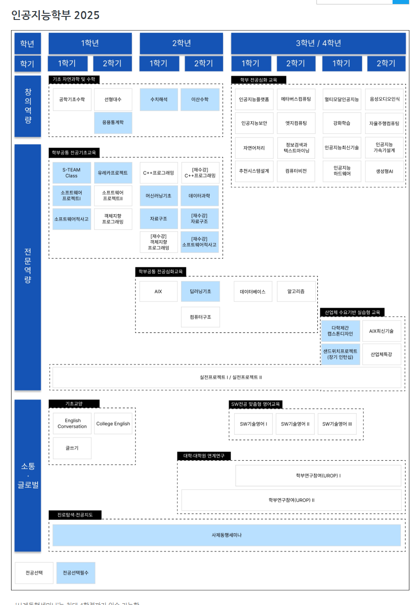

# 인공지능학부 커리큘럼 vs AI 로드맵(실무·에이전트 중심)

### 인공지능학부 커리큘럼

---

### AI 로드맵 (실무·에이전트 중심)  ****

- **1학년 → 2학년 → 3/4학년**
    - 기초 → 모델 이해 → 시스템/응용 → 에이전트
- 검은 테두리
    - 기본/필수 과목
- **빨간 테두리**
    - **실무·핵심 역량**
    - **프로그래밍, 시스템, 엔지니어링**
- 초록
    - 최종 응용(추천시스템)
    

---

## 1학년: AI 기초

- **목표: AI를 배울 수 있는 기초 만들기**
    - 수학: 선형대수, 확률, 미적분
    - 파이썬 프로그래밍
    - 자료구조 & 알고리즘
    - 컴퓨팅 기초
        - 리눅스, Git, 테스트, conda/venv 등
    - 인공지능 개론 (역사, 윤리 포함)
    - 코딩 + 수학이 약하면 힘듦

---

## 2학년: 모델 이해

- **목표: 모델이 왜 이렇게 움직이는지 이해**
    - 데이터 과학 (Pandas, NumPy, 시각화)
    - 머신러닝 기초
        - 회귀, SVM, Decision Tree 등
    - 딥러닝 기초
        - CNN, RNN, Transformer
    - **AI 프로그래밍**
        - PyTorch, 최적화, HuggingFace)
    - 이 시점부터 AI 진행

---

## 3–4학년: 실전 & 시스템 레벨

- **목표: AI를 서비스로 만든다**
- 모델·응용
    - 자연어처리 (+ LLM)
    - 추천시스템 설계
    - 모델 경량화 (프루닝, 양자화, 지식증류)
- 시스템·엔지니어링
    - 데이터베이스
        - Vector DB, 유사도 검색
    - 컴퓨터구조 (CPU/GPU, 메모리)
    - **AI 시스템 엔지니어링**
        - API, 비동기, Docker, 최적화, 파인튜닝
    - **고성능 AI 컴퓨팅**
        - CUDA, Triton

### 목표

- **AI 에이전트 프로그래밍**
    - MCP, RAG, 멀티에이전트
    - 여기까지 오면 **연구/산업 둘 다 가능**
    - **프로그래밍 + 시스템 + 모델**
- 빨간 박스 과목들 = **취업·연구 체감 난이도 결정 요소**

---

### 인공지능학부 커리큘럼 vs AI 로드맵(실무·에이전트 중심) ****

- **인공지능학부** 커리큘럼
    - 과목 중심 (교육과정)
- **AI 로드맵**
    - **결과물 중심(실무·연구 역량)**

---

### **인공지능학부** 2025 커리큘럼

- 과목 단위로 잘게 쪼개짐
- 전공 역량/창의 역량/소통 역량으로 구분
- 선택지가 많고 폭이 넓음
- 학부 기준 매우 체계적
- 최신 키워드 적극 반영
    - 생성형AI, 멀티모달, 보안 등
    - 이 과목들이 **어디로 수렴되는지**는 학생이 스스로 연결해야 함

---

### 실무·에이전트 로드맵

- **흐름 중심**
    - 기초 → 모델 → 시스템 → 에이전트
- 최종 목표가 명확함 : **AI 에이전트 프로그래밍**
- 졸업 시 결과물이 남음
- 실무/연구 공용 구조
    - 학교가 대신 안 가르쳐줌
    - 스스로 프로젝트를 해야 완성됨

---

## 인공지능학부 커리큘럼 vs AI 회의 로드맵 ****비교

### 1. 기초 수학 & CS

- **일치**

| **인공지능학부**  | AI 회의 로드맵 |
| --- | --- |
| 선형대수, 확률, 수치해석 | AI 수학 |
| C++, 자료구조, 알고리즘 | CS 기초 |

### 2. ML / DL

- 커버 범위는 **인공지능학부**가 더 넓음
    - **프로젝트 깊이는** AI 회의 **로드맵이 더 요구함**

| **인공지능학부**  | AI 회의 로드맵 |
| --- | --- |
| 머신러닝기초 | 머신러닝 |
| 딥러닝기초 | 딥러닝 |
| 멀티모달AI | 응용 DL |

### 3. 데이터 / DB / 검색

- **인공지능학부**
    - DB 과목 중 하나
- AI  회의 로드맵
    - **RAG 핵심**

| **인공지능학부**  | AI 회의  로드맵 |
| --- | --- |
| 데이터과학 | 데이터 처리 |
| 데이터베이스 | **Vector DB / Retrieval** |

### 4. 시스템 / 컴퓨팅

- **인공지능학부 :** **시스템을 가르칠 재료 준비**
    - 하지만 모델 서빙 + RAG + 에이전트로 자동 연결되지 않음

| **인공지능학부**  | AI 회의 로드맵 |
| --- | --- |
| 컴퓨터구조 | 컴퓨터구조 |
| 인공지능하드웨어 | 고성능 AI 컴퓨팅 |
| AI 플랫폼 | AI 시스템 엔지니어링 |

### 5. 최종

| **인공지능학부**  | AI 회의 로드맵 |
| --- | --- |
| 생성형AI, AIX최신기술 | **AI 에이전트 프로그래밍** |
| 캡스톤디자인 | 에이전트 기반 시스템 |

---

## 인공지능학부 커리큘럼 vs AI 회의 로드맵 비교

1. 기초 수학 & CS : **일치**

- **인공지능학부**
    - 선형대수
    - 응용통계학
    - 수치해석
    - C++프로그래밍
    - 자료구조
    - 알고리즘
- **AI 회의 커리큘럼 로드맵**
    - 인공지능수학 1,2
    - 파이썬 프로그래밍
    - 컴퓨팅 기초
    - 인공지능개론
    - 자료구조 & 알고리즘

2. 머신러닝 / 딥러닝 (ML / DL)

- **인공지능학부**
    - 머신러닝기초
    - 딥러닝기초
    - 멀티모달 AI
- **AI 회의 커리큘럼 로드맵**
    - 머신러닝
    - 딥러닝
    - 응용 딥러닝
    - 인공지능프로그래밍
- **차이**
    - 인공지능학부
        - 이론·주제 범위가 넓음
    - AI 회의 로드맵
        - 프로젝트·실습 깊이를 더 요구

3. 데이터 / 데이터베이스 / 검색

- **인공지능학부**
    - 데이터과학
    - 데이터베이스
        - DB 과목 중 하나로 다뤄짐
- **AI 회의 커리큘럼 로드맵**
    - 데이터 과학
    - 데이터베이스 : Vector DB, Retrieval
        - RAG 핵심 구성요소로 인식

4. 시스템 / 컴퓨팅

- **인공지능학부 :** 시스템을 가르칠 기반 제공
    - 컴퓨터구조
    - 인공지능하드웨어
    - AI 플랫폼
- **AI 회의 커리큘럼 로드맵 :** 모델 서빙 + RAG + 에이전트까지 직접 연결 요구
    - 컴퓨터구조
    - 고성능 AI 컴퓨팅
    - AI 시스템 엔지니어링
    - 모델경량화
    - 추천시스템설계
    - 자연어처리

5. 최종 목적

- **인공지능학부**
    - 생성형 AI
    - AIX 최신기술
    - 캡스톤디자인
- **AI 회의 커리큘럼 로드맵 : 에이전트 기반 시스템 완성**
    - AI 에이전트 프로그래밍
    - AI 시스템 엔지니어링

---

## 2025 교과과정 기반 · 총 10개 **마이크로전공**

### **[ AI 초급 마이크로전공 (AI Basic Level Micro Majors) : 3개 마이크로전공 ]**

- 인공지능의 기초 원리, 프로그래밍, 수학적 기반을 다지는 단계

**[1] AI 기초 초급 (마이크로전공) (AI Foundation Basic Level Micro Major)**

- **2학년 1학기:** C++ 프로그래밍
- **2학년 2학기:** 데이터과학
- **2학년 2학기:** 알고리즘

**[2] AI 수학·이론 초급 (마이크로전공) (AI Mathematical Theory Basic Level Micro Major)**

- **1학년 2학기:** 선형대수
- **2학년 1학기:** 수치해석
- **2학년 2학기:** 이산수학

**[3] AI 하드웨어 초급 (마이크로전공) (AI Hardware Basic Level Micro Major)**

- **2학년 1학기:** AIX
- **2학년 2학기:** 컴퓨터구조
- **2학년 2학기:** 딥러닝기초

### **[ AI 중급 마이크로전공 (AI Applied Level Micro Majors) : 3개 마이크로전공 ]**

- AI 기술을 실제 도메인·서비스에 적용하는 응용 중심 단계

**[4] AI 데이터사이언스 중급 (마이크로전공) (AI Data Science Applied Level Micro Major)**

- **2학년 2학기:** 데이터과학
- **3학년 1학기:** 데이터베이스
- **3학년 1학기:** 추천시스템설계

**[5] AI 보안 중급 (마이크로전공) (AI Security Applied Level Micro Major)**

- **3학년 1학기:** 데이터베이스
- **3학년 1학기:** 인공지능보안
- **3학년 1학기:** 인공지능플랫폼

**[6] AI 서비스 중급 (마이크로전공) (AI Service Engineering Applied Level Micro Major)**

- **3학년 2학기:** 정보검색과텍스트마이닝
- **3학년 2학기:** 메타버스컴퓨팅
- **4학년 1학기:** 엣지컴퓨팅

### **[ AI 고급 마이크로전공 (AI Advanced Level Micro Majors) : 4개 마이크로전공 ]**

- 첨단 AI 융합 및 산업 실무 중심의 심화 학습 단계

**[7] AI 응용 고급 (마이크로전공) (AI Application Advanced Level Micro Major)**

- **3학년 1학기:** 인공지능플랫폼
- **3학년 1학기:** 자연어처리
- **4학년 2학기:** 생성형AI

**[8] AI 로봇·자율시스템 고급 (마이크로전공) (AI Robotics & Autonomous Systems Advanced Level Micro Major)**

- **3학년 2학기:** 컴퓨터비전
- **4학년 2학기:** 자율주행컴퓨팅
- **4학년 2학기:** 인공지능가속기설계

**[9] AI 융합 고급 (마이크로전공) (AI Convergence Advanced Level Micro Major)**

- **4학년 1학기:** 멀티모달인공지능
- **4학년 2학기:** 음성오디오인식
- **4학년 1학기:** 강화학습

**[10] AI 산업특화 고급 (마이크로전공) (AI Industry-Specialized Advanced Level Micro Major)**

- **4학년 1학기:** 인공지능최신기술
- **4학년 1학기:** 다학제간캡스톤디자인
- **4학년 2학기:** AIX최신기술

# 전체 교과목 리스트 : **총 24과목**

- C++ 프로그래밍
- 데이터과학
- 알고리즘
- 선형대수
- 수치해석
- 이산수학
- AIX
- 컴퓨터구조
- 딥러닝기초
- 데이터베이스
- 추천시스템설계
- 인공지능보안
- 인공지능플랫폼
- 정보검색과텍스트마이닝
- 메타버스컴퓨팅
- 엣지컴퓨팅
- 자연어처리
- 생성형AI
- 컴퓨터비전
- 자율주행컴퓨팅
- 인공지능가속기설계
- 멀티모달인공지능
- 음성오디오인식
- 강화학습
- 인공지능최신기술
- 다학제간캡스톤디자인
- AIX최신기술

# AI **(에이전트 / 데이터 / 하드웨어)** 트랙 제안 ****

---

## I. 에이전트 트랙 (Agent / LLM / 서비스 중심)

**목표:** RAG + Tool + 시스템을 결합한 AI 에이전트 개발자

### 핵심 과목 (필수)

- 자연어처리
- 생성형AI
- 인공지능플랫폼
- 정보검색과텍스트마이닝
- 데이터베이스
- 추천시스템설계

### 시스템·서비스 보강

- 엣지컴퓨팅
- 메타버스컴퓨팅
- 인공지능보안

### 통합·완성

- 인공지능최신기술
- 다학제간캡스톤디자인
- AIX최신기술

특징

- RAG / Vector DB / 검색
- LLM + Tool Calling
- API·플랫폼 기반 서비스

---

## II. 데이터 트랙 (Data / ML / 추천·검색 중심)

**목표:** 데이터 분석·랭킹·추천·검색에 강한 AI/ML 엔지니어

### 데이터·이론 기반

- 데이터과학
- 선형대수
- 확률·통계 (응용통계학)
- 이산수학

### 모델·알고리즘

- 머신러닝기초
- 딥러닝기초
- 알고리즘

### 데이터 시스템·응용

- 데이터베이스
- 추천시스템설계
- 정보검색과텍스트마이닝

### 확장

- 강화학습
- 멀티모달인공지능

특징

- 데이터 전처리 → 모델 → 평가
- 랭킹/추천/검색 품질
- 실험 설계와 지표 중심 사고

---

## III. 하드웨어 트랙 (System / Edge / Autonomous 중심)

**목표:** 성능·지연·전력까지 고려하는 AI 시스템/하드웨어 엔지니어

### 시스템 기초

- 컴퓨터구조
- AIX
- 수치해석

### 모델·성능

- 딥러닝기초
- 인공지능가속기설계

### 비전·자율

- 컴퓨터비전
- 자율주행컴퓨팅

### 실시간·엣지

- 엣지컴퓨팅

### 통합

- AIX최신기술
- 다학제간캡스톤디자인

**특징**

- GPU/가속기/엣지
- 추론 속도·자원 최적화
- 로봇·자율·실시간 시스템

---

## 트랙 공통 과목 (교집합)

- 데이터과학
- 데이터베이스
- 딥러닝기초
- 인공지능플랫폼
- 다학제간캡스톤디자인

---

## 트랙 선택 가이드

- **에이전트 트랙**
    
    → LLM·RAG·서비스 진로
    
- **데이터 트랙**
    
    → 추천·검색·모델 성능 진로
    
- **하드웨어 트랙**
    
    → GPU·엣지·자율·성능 최적화 진로 
    
- 실제로는 에이전트 + 데이터 복합이 가장 많고, **하드웨어 트랙은 전문성 특화형**

---

## 중요

- **주 트랙 1개 + 보조 트랙 0.5개**가 이상적
    - 에이전트(주) + 데이터
- 캡스톤은 **주 트랙 정체성 100% 반영**

---

## 트랙별(에이전트 / 데이터 / 하드웨어) **마이크로전공 추천**

## I. 에이전트 트랙 : LLM · RAG · 서비스 중심

### 1. 추천 **마이크로전공**

**[1] AI 기초 초급→ [6] AI 서비스 중급→ [7] AI 응용 고급→ [10] AI 산업특화 고급**

- 초급
    - 코딩·데이터 기본 체력
- 중급
    - **검색·텍스트마이닝·엣지 = RAG의 Retrieval**
- 고급
    - **NLP + 생성형AI = Agent 두뇌**
- 산업특화
    - **캡스톤으로 에이전트 완성**

### 2. 졸업 시

- RAG 기반 AI 에이전트 / LLM 서비스 개발자

### 3. 대표 캡스톤

- 전공 지식 QA 에이전트
- 기업 문서 검색·요약 에이전트
- Tool-calling 업무 자동화 에이전트

---

### 2. 에이전트 + 데이터 강화형 **마이크로전공**

**[1] AI 기초 초급→ [4] AI 데이터사이언스 중급→ [7] AI 응용 고급→ [10] AI 산업특화 고급**

- Retrieval 품질·랭킹·평가에 강한 에이전트

---

## II. 데이터 트랙 : 추천·검색·ML / 성능 중심

### 1. 추천 **마이크로전공**

**[2] AI 수학·이론 초급→ [4] AI 데이터사이언스 중급→ [9] AI 융합 고급→ [10] AI 산업특화 고급**

- 수학·이론
    - 모델 이해력
- 데이터사이언스:
    - **추천·DB·평가**
- 융합 고급
    - **강화학습·멀티모달 확장**
- 산업특화
    - 실전 문제 정의 + 캡스톤

### 2. 졸업 시

- 추천·검색·랭킹에 강한 데이터/ML 엔지니어

### 3. 대표 캡스톤

- 추천 시스템 고도화 프로젝트
- 로그 기반 검색/랭킹 개선
- 멀티모달 데이터 분석

---

### 2. 데이터 + 에이전트 결합형

**[2] AI 수학·이론 초급→ [4] AI 데이터사이언스 중급→ [7] AI 응용 고급→ [10] AI 산업특화 고급**

- 에이전트는 만들 줄 아는데, 검색 품질도 설명 가능한 타입

---

## III. 하드웨어 트랙 : 시스템 · 엣지 · 자율 · 성능 중심 / 특화형

### 1. 추천 **마이크로전공**

**[3] AI 하드웨어 초급→ [6] AI 서비스 중급→ [8] AI 로봇·자율시스템 고급→ [10] AI 산업특화 고급**

- 하드웨어 초급
    - 컴퓨터구조·AIX·DL 기초
- 서비스 중급
    - **엣지·실시간 시스템**
- 로봇/자율
    - 비전·자율주행·가속기
- 산업특화
    - 실제 시스템 통합

### 2. 졸업 시

- 엣지·자율·실시간 AI 시스템 엔지니어

### 3. 대표 캡스톤

- 엣지 비전 추론 시스템
- 자율주행 인지 파이프라인
- 모델 경량화 + 가속기 비교

---

### 2. 하드웨어 + 에이전트 혼합형 **마이크로전공**

**[3] AI 하드웨어 초급→ [6] AI 서비스 중급→ [7] AI 응용 고급→ [10] AI 산업특화 고급**

- 온디바이스 LLM / 엣지 에이전트 타입

---

## IV. 복합 트랙 : 상위권 학생용

### 1. 에이전트 + 데이터 (실무 친화)

**[1] AI 기초 초급→ [4] AI 데이터사이언스 중급→ [7] AI 응용 고급→[10] AI 산업특화 고급**

### 2. 에이전트 + 하드웨어 (난이도 높음)

**[3] AI 하드웨어 초급→ [6] AI 서비스 중급→ [7] AI 응용 고급→ [10] AI 산업특화 고급**

---

### 선택 가이드

- LLM·챗봇·RAG 하고 싶다
    
    → **에이전트 트랙**
    
- 추천·검색·모델 성능이 재밌다
    
    → **데이터 트랙**
    
- GPU·엣지·자율·실시간
    
    → **하드웨어 트랙**
    
- [10] AI 산업특화 고급(캡스톤)
    - **모든 트랙의 종착지**

---

---

# AI 마이크로전공 체계 (기업 참여형 교과목 반영안)

---

## Ⅰ. AI 초급 마이크로전공 (AI Basic Level Micro Majors, 3개)

- 인공지능의 기초 원리, 프로그래밍, 수학·시스템 기반 역량 확보 *(AI 전공 공통 체력 단계)*

---

### [1] AI 기초 초급 *(AI Foundation Basic Level Micro Major)*

- **2학년 1학기:** C++ 프로그래밍
- **2학년 2학기:** 데이터과학
- **2학년 2학기:** 알고리즘

- 프로그래밍·데이터·문제해결 기본기
- 상위 마이크로전공 진입을 위한 필수 기초

---

### [2] AI 수학·이론 초급 *(AI Mathematical Theory Basic Level Micro Major)*

- **1학년 2학기:** 선형대수
- **2학년 1학기:** 수치해석
- **2학년 2학기:** 이산수학

- 머신러닝·딥러닝 수학적 이해
- 모델·알고리즘 해석 능력 강화

---

### [3] AI 하드웨어 초급 *(AI Hardware Basic Level Micro Major)*

- **2학년 1학기:** AIX
- **2학년 2학기:** 컴퓨터구조
- **2학년 2학기:** 딥러닝기초

- CPU/GPU·메모리·추론 구조 이해
- 엣지·고성능 AI로의 진입 기반

---

## Ⅱ. AI 중급 마이크로전공 (AI Applied Level Micro Majors, 3개)

- AI 기술을 실제 **도메인·서비스·시스템**에 적용 *(실무 전환 단계)*

---

### [4] AI 데이터사이언스 중급 *(AI Data Science Applied Level Micro Major)*

- **2학년 2학기:** 데이터과학
- **3학년 1학기:** 데이터베이스
- **3학년 1학기:** 추천시스템설계

- 데이터 처리 → 저장 → 검색/추천
- RAG·검색·랭킹 시스템 기반 역량

---

### [5] AI 보안 중급 *(AI Security Applied Level Micro Major)*

- **3학년 1학기:** 데이터베이스
- **3학년 1학기:** 인공지능보안
- **3학년 1학기:** 인공지능플랫폼

- AI 서비스 보안·신뢰성
- 기업·산업 적용을 위한 운영 관점 강화

---

### [6] AI 서비스 중급 *(AI Service Engineering Applied Level Micro Major)*

- **3학년 2학기:** 정보검색과텍스트마이닝
- **3학년 2학기:** 메타버스컴퓨팅
- **4학년 1학기:** 엣지컴퓨팅

- 검색·텍스트·서비스 파이프라인
- 실시간·엣지 기반 AI 서비스 설계

---

## Ⅲ. AI 고급 마이크로전공 (AI Advanced Level Micro Majors, 4개)

- 첨단 AI 기술 융합 및 **산업 실무 중심 심화 학습** *(캡스톤·기업 연계 중심)*

---

### [7] AI 응용 고급

*(AI Application Advanced Level Micro Major)*

- **3학년 1학기:** 인공지능플랫폼
- **3학년 1학기:** 자연어처리
- **4학년 2학기:** 생성형AI

- LLM·NLP·생성형 AI 응용
- RAG·에이전트 기술 핵심 트랙

---

### [8] AI 로봇·자율시스템 고급 *(AI Robotics & Autonomous Systems Advanced Level Micro Major)*

- **3학년 2학기:** 컴퓨터비전
- **4학년 2학기:** 자율주행컴퓨팅
- **4학년 2학기:** 인공지능가속기설계

- 실시간·비전·자율·하드웨어 특화
- 로봇·제조·자율 시스템 적용

---

### [9] AI 융합 고급 *(AI Convergence Advanced Level Micro Major)*

- **4학년 1학기:** 멀티모달인공지능
- **4학년 2학기:** 음성오디오인식
- **4학년 1학기:** 강화학습

- 멀티모달·음성·RL 융합
- 차세대 AI 응용 확장

---

### [10] AI 산업특화 고급 *(AI Industry-Specialized Advanced Level Micro Major)*

- **4학년 1학기:** 인공지능최신기술
- **4학년 1학기:** 다학제간캡스톤디자인
- **4학년 2학기:** AIX최신기술

- 산업 문제 정의 → 해결 → 결과물
- 모든 트랙의 **최종 종착점**

---

## Ⅳ. 기업 참여형 마이크로전공

### 1. 기업 참여형 **기초** 마이크로전공 (전 트랙 공통)

- AI 프로그래밍
- 데이터 분석 및 시각화
- 생성형 AI 활용 (LLM, Vision AI 등)
- 산업 문제 해결 방법론

- 실무 감각 조기 확보
- 기업 문제 이해 기반 형성

---

### 2. 기업 참여형 **심화** 마이크로전공 : **[10] AI 산업특화 고급** 및 **[7]/[8] 고급 마이크로전공과 결합**

- **AI 기업 문제 해결 실습Ⅰ**
    - 기업 제공 문제 + 멘토링
    - **산출물:** PBL 결과물, 보고서
- **산업데이터 분석 프로젝트**
    - 기업 데이터셋 제공
    - **산출물:** 분석 리포트
- **생성형 AI 기반 실전 서비스 개발**
    - 기업 기술 자문
    - **산출물:** MVP / 프로토타입
- **스마트 제조 AI 응용**
    - 제조기업 PoC 제공
    - **산출물:** 모델 + 대시보드

---

##
